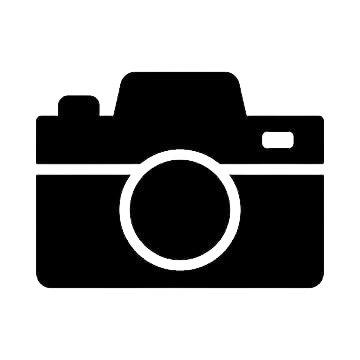

# 📝 PANDUAN EDIT - SEISMIC ORBIT

Panduan lengkap untuk mengedit gambar, logo, dan link di website.

---

## 📂 Struktur File yang Perlu Diedit

```
assets/
├── logos/
│   ├── seismic-logo.png        ← Logo SEISMIC INDONESIA (header atas tengah)
│   ├── center-logo.png         ← Logo orbit pusat
│   ├── orbit-1.png sampai orbit-9.png  ← Logo orbit 1-9
│   └── member photos...
└── icons/
    ├── camera-icon.png         ← Icon kamera untuk screenshot
    ├── logo1.png               ← Logo untuk file icon 1
    ├── logo2.png               ← Logo untuk file icon 2
    └── logo3.png               ← Logo untuk file icon 3
```

---

## 🎨 1. GANTI LOGO SEISMIC INDONESIA (Header Atas Tengah)

**File:** `index.html`

**Cari baris:**
```html
<div id="header-logo">
    
</div>
```

**Edit:**
- Ganti `assets/logos/seismic-logo.png` dengan path logo Anda
- Recommended size: 400x100px atau 800x200px
- Format: PNG (dengan transparency) atau JPG

---

## 📸 2. GANTI ICON SCREENSHOT (Pojok Kiri Atas)

**File:** `index.html`

**Cari baris:**
```html
<button id="screenshot-btn" title="Download Screenshot">
    
</button>
```

**Edit:**
- Ganti `assets/icons/camera-icon.png` dengan icon Anda
- Recommended size: 64x64px atau 128x128px
- Format: PNG (dengan transparency)
- Icon akan otomatis jadi putih

---

## 📁 3. GANTI FILE ICONS (Pojok Kanan)

**File:** `index.html`

**Cari section:**
```html
<div id="file-icons">
    <!-- File Icon 1 -->
    <a href="https://example1.com" target="_blank" class="file-icon" title="Link 1">
        <div class="folder-icon">
            
        </div>
    </a>
    
    <!-- File Icon 2 -->
    <a href="https://example2.com" target="_blank" class="file-icon" title="Link 2">
        <div class="folder-icon">
            
        </div>
    </a>
    
    <!-- File Icon 3 -->
    <a href="https://example3.com" target="_blank" class="file-icon" title="Link 3">
        <div class="folder-icon">
            
        </div>
    </a>
</div>
```

**Edit untuk setiap icon:**

1. **Ganti URL:** `href="https://example1.com"` → URL tujuan Anda
2. **Ganti Logo:** `src="assets/icons/logo1.png"` → path logo Anda
3. **Ganti Title:** `title="Link 1"` → nama link

**Contoh:**
```html
<a href="https://instagram.com/seismic" target="_blank" class="file-icon" title="Instagram">
    <div class="folder-icon">
        
    </div>
</a>
```

**Logo Settings:**
- Recommended size: 128x128px
- Format: PNG (dengan transparency)
- Logo akan muncul di tengah folder merah

---

## 🔍 4. SEARCH USER

**Tidak perlu edit code!**
- Search otomatis mencari di semua member (center + orbit 1-9)
- Ketik nama → Enter atau klik Search
- Hasil muncul dalam modal

---

## 👤 5. EDIT CREDITS (Pojok Kiri Bawah)

**File:** `index.html`

**Cari section:**
```html
<div id="credits">
    <p>Built by <a href="https://x.com/Elv214" target="_blank">@Elv214</a></p>
    <p>Supported by <a href="https://x.com/seismicosysIDN" target="_blank">@seismicosysIDN</a></p>
</div>
```

**Edit:**
- Ganti `@Elv214` dengan username Anda
- Ganti `https://x.com/Elv214` dengan link profile Anda
- Ganti `@seismicosysIDN` dengan nama supporter
- Ganti `https://x.com/seismicosysIDN` dengan link profile supporter

---

## 🖼️ 6. GANTI LOGO ORBIT & CENTER

Sudah ada di `js/data.js` (tidak perlu edit di HTML)

**File:** `js/data.js`

**Center logo:**
```javascript
const centerConfig = {
    name: "Community Center",
    logo: "assets/logos/center-logo.png"  // Edit di sini
};
```

**Orbit logos:**
```javascript
const orbitConfig = [
    { id: 1, name: "Orbit 1", logo: "assets/logos/orbit-1.png", color: "#f5f5dc" },
    // ... edit logo path di sini
];
```

---

## 📸 7. CARA PAKAI SCREENSHOT

1. User klik **icon kamera** (pojok kiri atas)
2. Otomatis download screenshot full page
3. Format: PNG
4. Nama file: `seismic-orbit-2024-12-24.png`

---

## ✅ CHECKLIST EDIT

- [ ] Logo SEISMIC INDONESIA (header)
- [ ] Icon screenshot (kamera)
- [ ] File icon 1 (logo + link)
- [ ] File icon 2 (logo + link)
- [ ] File icon 3 (logo + link)
- [ ] Credits username & link
- [ ] Logo center orbit
- [ ] Logo orbit 1-9
- [ ] Data member (di data.js)

---

## 🎨 RECOMMENDED SIZES

| Element | Size | Format |
|---------|------|--------|
| Logo SEISMIC | 800x200px | PNG/JPG |
| Icon Screenshot | 128x128px | PNG |
| File Icons (logo) | 128x128px | PNG |
| Center Logo | 512x512px | PNG |
| Orbit Logos | 256x256px | PNG |
| Member Photos | 300x300px | JPG |

---

## 🚀 SETELAH EDIT

1. Save semua file
2. Upload foto/logo ke folder yang sesuai
3. Refresh browser (`Ctrl+Shift+R`)
4. Test semua link dan fungsi
5. Test screenshot
6. Test search user

---

## ⚠️ TIPS

- Pakai PNG dengan transparency untuk logo
- Compress foto member (max 500KB per foto)
- Test di mobile browser juga
- Screenshot akan include semua elemen yang terlihat

---

**Selamat mengedit! 🎉**
